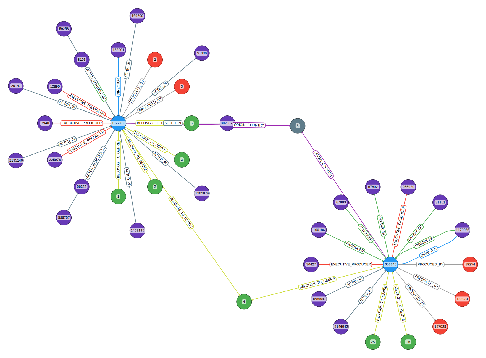
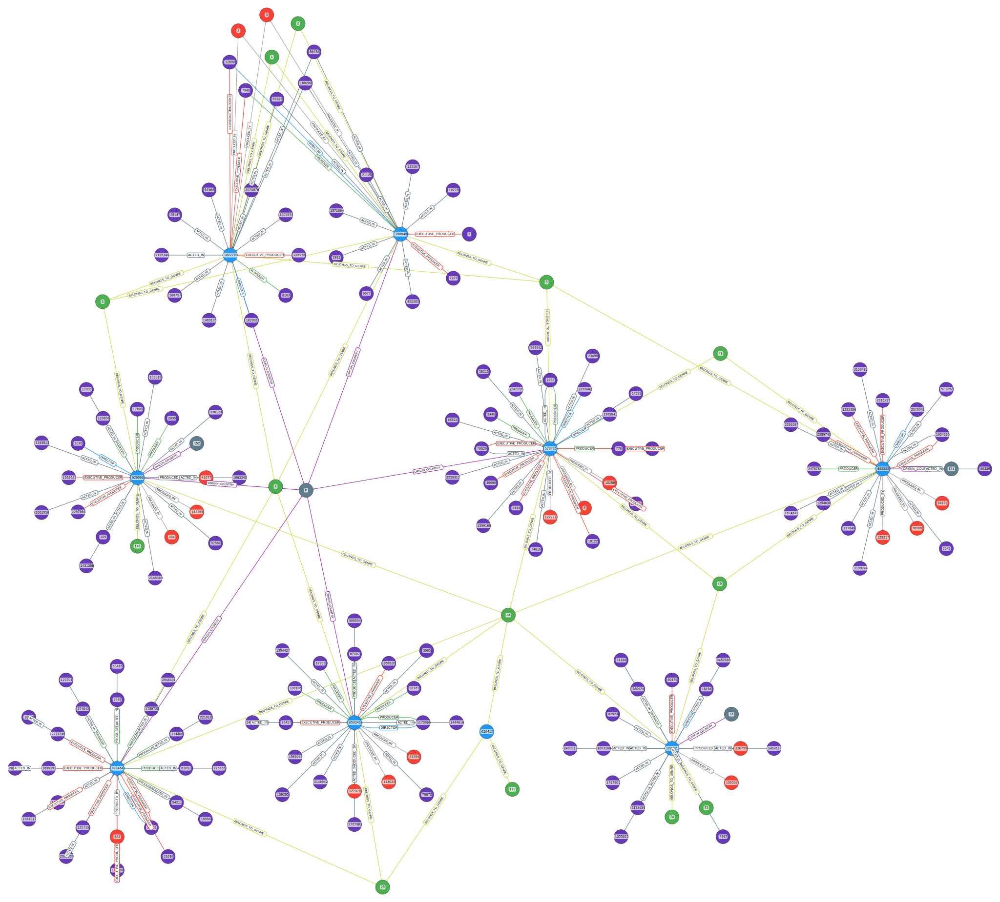

# QA/RAG with Movies Knowledge Graph (Neo4j)

## 下载数据

数据来源 [TMDB](https://www.themoviedb.org/):

- 搜索: `"https://api.themoviedb.org/3/movie/popular?api_key={api_key}&page={page}"`;
- 电影详情: `"https://api.themoviedb.org/3/movie/{movie_id}?api_key={api_key}&append_to_response=credits"`

```py
from movies import MoviesKG
movies_kg = MoviesKG(download=True, num_pages=100)
```

获取前 `num_pages` 页的电影详细信息.

[原始数据示例](./assets/raw_data_eg.md)

## 数据分析

`data_describe.DataDescribe` 定义了一些方法用以对电影数据中的某些数据项可视化的方法.

## 数据处理

由于获取的数据已经是结构化的 json 数据, 主要工作集中在字典键的筛选和值的处理, 以符合数据库 (NEO4j) 的存储要求 (属性值只能为数值或字符串, 不能为字典) .

[处理后数据示例](./assets/processed_data_eg.md), 具体处理细节见 `movies.MoviesKG.filter_one_data()`.

## 知识图谱构建

部分数据图示

<div style="display: flex; justify-content: space-between;">
    
    
</div>
<!-- 
 -->

|     节点类型      |                             颜色                             |        含义         |
| :---------------: | :----------------------------------------------------------: | :-----------------: |
|       Movie       | <div style="background-color: #2194f0; width: 20px; height: 20px; border-radius: 50%; display: inline-block;"></div> |        电影         |
|       Genre       | <div style="background-color: #4cac50; width: 20px; height: 20px; border-radius: 50%; display: inline-block;"></div> |        类型         |
| ProductionCompany | <div style="background-color: #f44336; width: 20px; height: 20px; border-radius: 50%; display: inline-block;"></div> |      制作公司       |
|      Country      | <div style="background-color: #607d89; width: 20px; height: 20px; border-radius: 50%; display: inline-block;"></div> |        国家         |
|      Person       | <div style="background-color: #673ab6; width: 20px; height: 20px; border-radius: 50%; display: inline-block;"></div> | 人（演员、导演...） |


图中节点属性及关系属性:

```py
Node properties:
Movie {budget: INTEGER, id: INTEGER, title: STRING, tagline: STRING, belongs_to_collection: STRING, runtime: INTEGER, overview: STRING, revenue: INTEGER, release_date: STRING}
Genre {name: STRING}
ProductionCompany {origin_country: STRING, name: STRING, id: INTEGER}
Country {name: STRING}
Person {name: STRING, id: INTEGER, gender: INTEGER}
Relationship properties:
ACTED_IN {character: STRING}
The relationships:
(:Movie)-[:BELONGS_TO_GENRE]->(:Genre)
(:Movie)-[:PRODUCED_BY]->(:ProductionCompany)
(:Movie)-[:ORIGIN_COUNTRY]->(:Country)
(:Person)-[:ACTED_IN]->(:Movie)
(:Person)-[:EXECUTIVE_PRODUCER]->(:Movie)
(:Person)-[:DIRECTOR]->(:Movie)
(:Person)-[:PRODUCER]->(:Movie)
```

## QA 系统搭建

主要基于 `ChatZhipuAI, GraphCypherQAChain, Neo4jGraph`, 定义方式为:

```py
llm = ChatZhipuAI(
    temperature=0,
    zhipuai_api_key=os.getenv("ZHIPUAI_API_KEY"),
    model_name="GLM-4-0520",
    # model_name="GLM-4-Flash",
)
graph = Neo4jGraph(
    url="bolt://localhost:7687", username="neo4j", password=os.getenv("NEO4J_PASSWORD")
)
chain = GraphCypherQAChain.from_llm(llm, graph=graph, verbose=True)
```

预设了几个测试问题:

```py
class QUESTION(str, Enum):
    # 简单单跳问题
    Q11 = "Who starred in 'The Dark Knight'?"
    Q12 = "Who directed 'The Dark Knight'?"
    Q13 = "Which movies did Christopher Nolan direct?"

    # 添加筛选条件
    Q21 = (
        "Besides 'The Dark Knight', which other movies has Christopher Nolan directed?"
    )
    Q22 = "In which movies have Michael Caine and Maggie Gyllenhaal co-starred?"

default_questions = [question.value for question in QUESTION]
```

再用 `gradio` 部署 demo:

```py
# Corrected Gradio interface setup
iface = gr.Interface(
    fn=get_answer,
    inputs=[
        gr.Dropdown(
            choices=default_questions,
            label="Select a question",
            value=default_questions[0],
        ),  # 默认选择第一个问题
        gr.Textbox(lines=2, label="Or enter your question here..."),
    ],
    outputs=gr.Textbox(lines=10, label="Output"),  # 增加输出行数
    title="GraphCypher QA System",
    description="Ask any question related to the movie database.",
)


# Launch the Gradio app
iface.launch(share=True)
```
